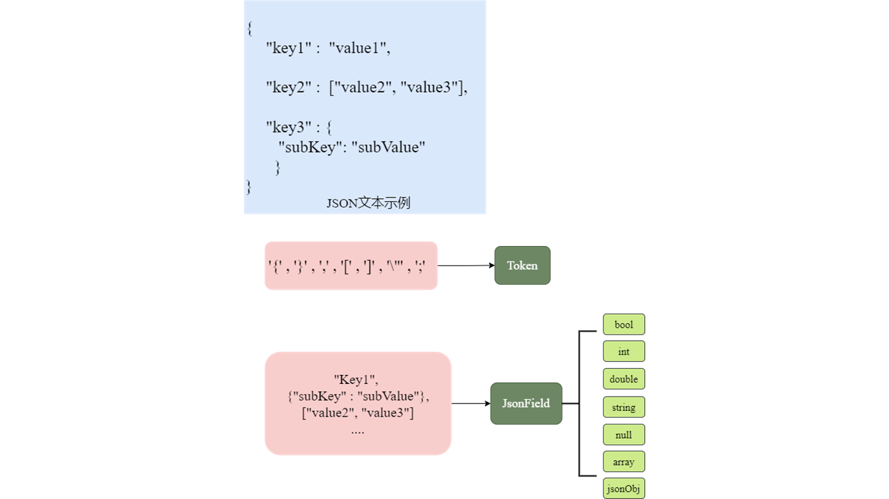
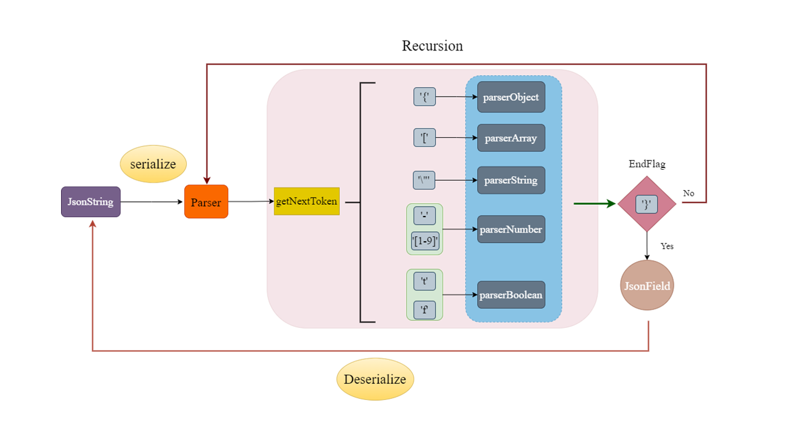

### DESCRIBE

------

A lightweight JSON parser and serializer library written in C++17

### Architecture

------

对于标准JSON格式文本如下图所示，个人主要将其分为两个部分：

1）Token字段，如:'{', '}', '[', ']',...等各字符。

2）Field， 即K-V结构中的具体的字段值， 该字段同时带有类型属性。本parser主要分为7中常规类型。



parser工作流程如下图所示。该parser为递归型parser，初始化JSONString后,会首先获取其Token，根据token在对后面的field的不同选取其对应的parserMethod，直到所有字段解析完成退出。

同时，也提供了一个序列化方法，可以将本parser解析的JSON对象转换为string格式对象。



### Usage

------

本parser库为header-only库，引入头文件即可，具体用法如下示例:

```cpp
#include "../src/json_parser.hpp"

std::string sJson = R"({
  "name": "example",
  "version": 1,
  "description": "This is a sample JSON file.",
  "enabled": true
})";

void usage01() {
  yoyo::JsonValue root;
  yoyo::JsonParser parser(sJson);
  root = parser.parser();
  std::string sName = root["name"];
  int iVersion = root["version"];
  bool bEnable = root["enabled"];
  std::cout << "sName: " << sName << "\n"
            << "iVersion: " << iVersion << "\n"
            << "bEnable: " << bEnable << std::endl;
}

void usage02() {
  yoyo::JsonValue root = yoyo::parserJson(sJson);
  std::string sName = root["name"];
  int iVersion = root["version"];
  bool bEnable = root["enabled"];
  std::cout << "sName: " << root["name"] << "\n"
            << "iVersion: " << root["version"] << "\n"
            << "bEnable: " << root["enabled"] << std::endl;

  // std::cout << root.writeToString() << std::endl;
}

int main() {
  usage01();
  usage02();
  return 0;
}

```

###### 编译命令

```shell
g++ usage.cc -o a.out -std=c++17
```

##### 输出结果为：

```shell
sName: example
iVersion: 1
bEnable: 1
sName: "example"
iVersion: 1
bEnable: true
{"description":"This is a sample JSON file.","enabled":true,"name":"example","version":1}	// std::cout << root.writeToString()
```

### UnitTest

------

基于doctest库的单元测试代码详见tests/目录，各单测结果如下所示。

```shell
[doctest] doctest version is "2.4.11"
[doctest] run with "--help" for options
===============================================================================
[doctest] test cases:  1 |  1 passed | 0 failed | 0 skipped
[doctest] assertions: 24 | 24 passed | 0 failed |
[doctest] Status: SUCCESS!
```

### BenchMark

------

基于nanobench库做压测，性能测试代码如下，将其与jsoncpp库与nlohmannJson库进行测试对比。

```cpp
#define ANKERL_NANOBENCH_IMPLEMENT
#include <jsoncpp/json/json.h>

#include "../src/json_parser.hpp"
#include "./nanobench.h"
#include "./nlohmannJson.hpp"

int main() {
  // 打开 JSON 文件
  std::ifstream inputFile("./test_data.json");
  if (!inputFile) {
    std::cerr << "Failed to open the JSON file!" << std::endl;
    return 1;
  }
  // 将文件内容读取到 std::string 中
  std::string jsonString;
  try {
    // 使用流迭代器直接读取文件内容
    inputFile.seekg(0, std::ios::end);  // 移动到文件末尾
    jsonString.reserve(
        inputFile.tellg());  // 提前调整字符串容量（非必须，但提高性能）
    inputFile.seekg(0, std::ios::beg);  // 回到文件开头
    jsonString.assign((std::istreambuf_iterator<char>(inputFile)),
                      std::istreambuf_iterator<char>());  // 读取内容
  } catch (const std::exception& e) {
    std::cerr << "Error while reading file: " << e.what() << std::endl;
    return 1;
  }
  ankerl::nanobench::Bench().run("my_tiny_jsonparser", [&jsonString] {
    yoyo::JsonValue jValue = yoyo::parserJson(jsonString);
    ankerl::nanobench::doNotOptimizeAway(jValue);
  });

  ankerl::nanobench::Bench().run("jsoncpp", [&jsonString] {
    Json::Value root;
    Json::CharReaderBuilder builder;
    std::string errs;
    std::istringstream ifs(jsonString);
    if (!Json::parseFromStream(builder, ifs, &root, &errs)) {
      std::cerr << "Failed to parse JSON: " << errs << std::endl;
      return;
    }
    ankerl::nanobench::doNotOptimizeAway(root);
  });

  ankerl::nanobench::Bench().run("nlohmann_json", [&jsonString] {
    nlohmann::json j = nlohmann::json::parse(jsonString);
    ankerl::nanobench::doNotOptimizeAway(j);
  });
}

```

测试结果如下所示:

**编译代码开启-O2优化**

```cpp
g++ benchmark.cc -o a.out -std=c++20 -ljsoncpp -O2
```

| ns/op      | op/s      | err% | ins/op       | cyc/op     | IPC   | bra/op     | miss% | total | benchmark            |
| ---------- | --------- | ---- | ------------ | ---------- | ----- | ---------- | ----- | ----- | -------------------- |
| 77,306.67  | 12,935.49 | 0.8% | 730,803.87   | 228,966.67 | 3.192 | 174,019.60 | 1.6%  | 0.01  | `my_tiny_jsonparser` |
| 117,220.00 | 8,530.97  | 0.4% | 1,173,552.67 | 347,958.33 | 3.373 | 261,564.11 | 1.2%  | 0.01  | `jsoncpp`            |
| 94,016.67  | 10,636.41 | 1.2% | 951,311.50   | 278,340.91 | 3.418 | 219,622.75 | 1.0%  | 0.01  | `nlohmann_json`      |

**编译代码不开优化**

```cpp
 g++ benchmark.cc -o a.out -std=c++20 -ljsoncpp 
```

| ns/op        | op/s     | err% | ins/op       | cyc/op       | IPC   | bra/op       | miss% | total | benchmark            |
| ------------ | -------- | ---- | ------------ | ------------ | ----- | ------------ | ----- | ----- | -------------------- |
| 852,100.00   | 1,173.57 | 0.1% | 5,816,921.00 | 2,534,000.00 | 2.296 | 1,037,888.00 | 1.2%  | 0.01  | `my_tiny_jsonparser` |
| 126,600.00   | 7,898.89 | 1.4% | 1,208,389.00 | 379,875.00   | 3.181 | 267,827.00   | 1.2%  | 0.01  | `jsoncpp`            |
| 1,043,500.00 | 958.31   | 0.6% | 7,616,955.00 | 3,087,250.00 | 2.467 | 1,243,863.00 | 0.5%  | 0.01  | `nlohmann_json       |

```cpp
// 测试指标各字段含义
/**
ns/op：每个bench内容需要经历的时间（ns为单位）。
op/s：每秒可以执行多少次操作。
err%：运行多次测试的波动情况（误差）。
ins/op：每次操作需要多少条指令。
cyc/op：每次操作需要多少次时钟周期。
bra/op：每次操作有多少次分支预判。
miss%：分支预判的miss率。
total：本次消耗的总时间。
benchmark：对应的名字
*/
```

可见在-O2优化选项上，本parser相较于其他paser具有更好好的性能。

### Build

------

执行./build.sh脚本：

```shell
./build.sh -h 
Usage: ./build.sh [options]
Options:
  -d <dir>         Specify the build directory (default: build)
  -t <type>        Specify the build type: Debug|Release (default: Debug)
  -o               Enable optimization (-O2)
  -h               Show this help message
```

```bash
./build.sh -d my_build_dir // 该命令会将构建目录设置为 my_build_dir(默认为 build)。

./build.sh -t Release     // 该命令会将 BUILD_TYPE 设置为 Release(默认为DEBUG)。

./build.sh -o			// 开启O2优化 默认为不开优化
```

PS： 执行脚本时需要本地环境有jsoncpp的动态链接库，否则会导致链接报错，可手动注释掉benchmark.cc中的jsoncpp相关部分代码在进行编译。

### Todo

------

* 部分操作符未重载, 如全局 operator==(T&&, yoyo::JsonValue&& rhs)...等

* 目前parser递归深度为固定写死，可提供set接口供user修改。
* 进一步优化parser性能。